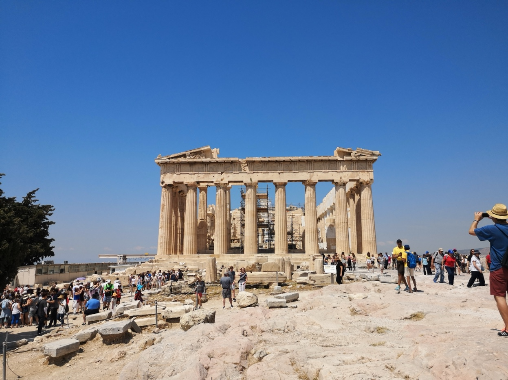
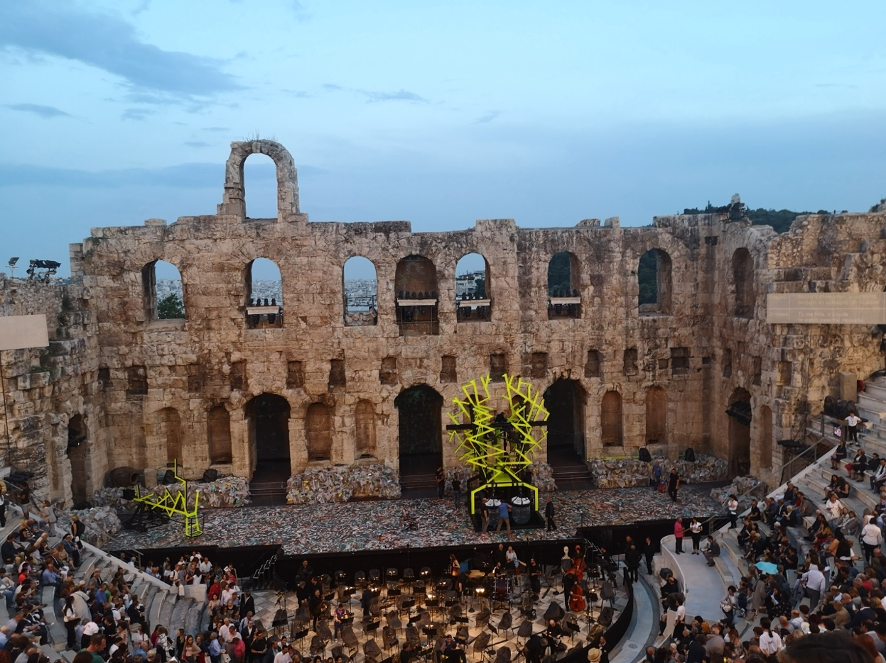
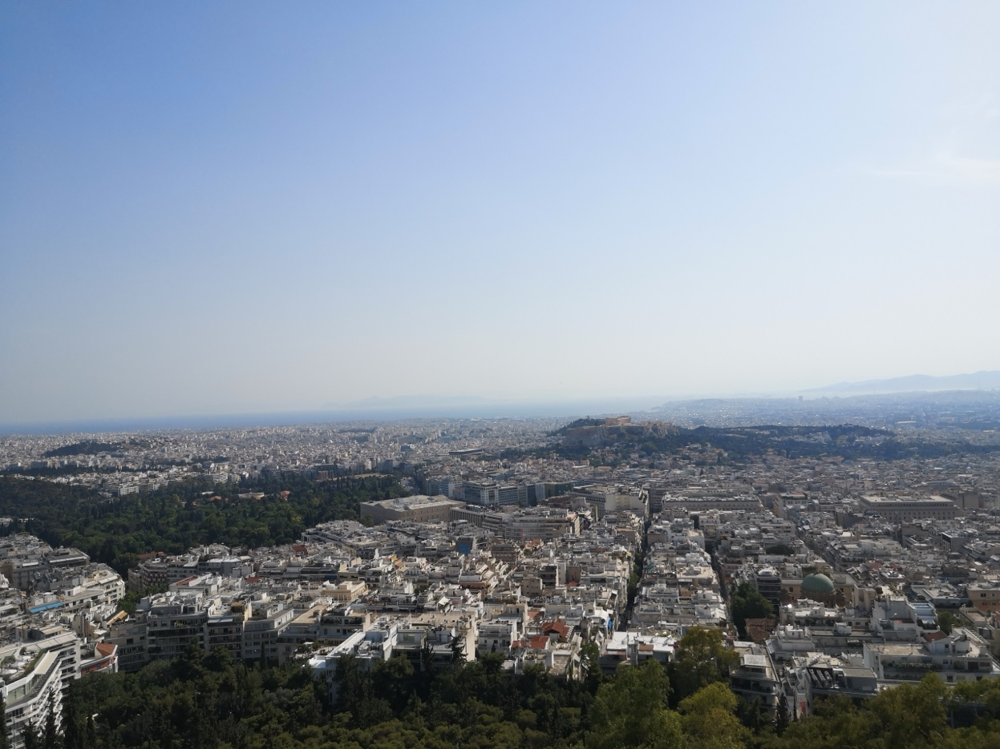
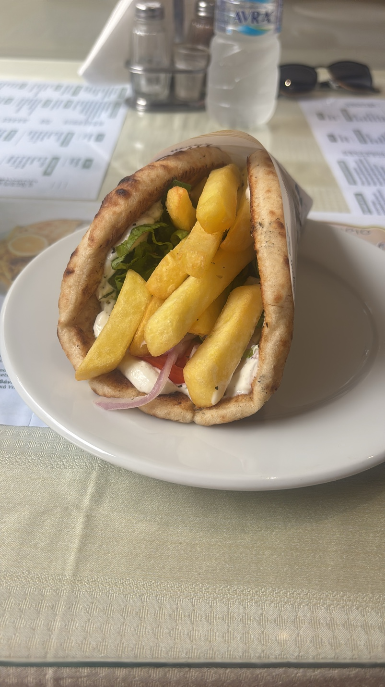

I've always been into Greek mythology. Growing up on stories of the Parthenon, the gods on Olympus, the Odyssey. Athens had been on my list for a while. When I finally booked it, I went looking for what other travel blogs had to say and got surprisingly mixed reviews. Too touristy. Too hot. Not worth more than a day. I'm glad I ignored most of it.

The ruins lived up to the mythology, but what I wasn't prepared for was the food. Greek food is on another level. I don't just mean the sit-down restaurants, although those were great. I mean the bakeries, the street food, the market stalls, the €3 souvlaki that somehow tastes better than anything you'd pay five times more for back home. I ate incredibly well for almost nothing, and it ended up being one of the better city breaks I've done.

Here's how I spent three days there.

---

## Day 1. The Acropolis & the Old Town

**Morning: Acropolis & Parthenon**

I arrived around 10am, which was too late. It was already busy. The gates open at 8am and that's when you want to be there, especially in summer. I booked a combined ticket online for €30, which covers the Acropolis plus five other archaeological sites and lasts five days.

The walk up takes about 15 minutes. The Parthenon is the obvious draw but I spent more time than I expected at the Erechtheion and just looking out over the city. I was up there for about 90 minutes.

> 💡 **Tip:** Bring water. It gets hot up there and there's no shade. Also wear shoes with decent grip. The marble paths are worn smooth and properly slippery. I saw a couple of people go down.

**Afternoon: Plaka & Monastiraki**

I walked downhill into Plaka, the oldest neighbourhood in Athens. It's touristy but hard to dislike. Narrow streets, bougainvillea on every wall, little shops selling olive oil soap and evil-eye stuff. From there I headed to Monastiraki Square and got my first souvlaki of the trip. Found a place with a queue of locals, paid about €3.50 for a loaded pita wrap, and ate it sitting on a wall watching the square. You genuinely cannot get anything close to this quality for that price in the UK. It's not even in the same league.

**Evening: Rooftop Drinks & the Odeon of Herodes Atticus**

Athens has a ridiculous number of rooftop bars. Having a cocktail on a rooftop terrace is one of my favourite things to do on a city break, and Athens might be the best city I've found for it. I picked a spot on Adrianou Street with a direct Acropolis view and had a couple of cocktails (around €10 each) while the Parthenon lit up. Hard to beat.

After that I went to a show at the Odeon of Herodes Atticus, the ancient open-air theatre on the south slope of the Acropolis. It's a 2,000-year-old stone amphitheatre that still hosts live performances through the summer. Music, dance, theatre. Sitting in that setting as it gets dark, with the Acropolis lit up directly above you, is something I'd recommend to anyone visiting Athens. Check the Athens & Epidaurus Festival programme before you go and book tickets in advance if anything catches your eye. They do sell out.

---

## Day 2. Museums, Markets & Street Food

**Morning: Acropolis Museum**

I don't usually bother with museums but this was worth the time. The ground floor has glass panels in the floor so you can see the excavation underneath, and the top gallery is laid out to mirror the Parthenon. €15 entry, about two hours.

**Afternoon: Central Market & Psyrri**

The Athens Central Market (Varvakios Agora) on Athinas Street is chaotic. Dried herbs, nuts, olives, huge wheels of cheese piled everywhere. Not polished or pretty, but it's the most real part of the city I found. After that I wandered into Psyrri, which is basically an open-air street art gallery. Good cafés, a few vintage shops, decent tavernas.

| Meal | Where I Ate | What I Paid |
|---|---|---|
| Breakfast | Neighbourhood bakery. Spanakopita (spinach & feta pastry) | €2.50 |
| Lunch | Taverna in Psyrri. Grilled halloumi, stuffed peppers, fava dip | €12 |
| Dinner | Rooftop restaurant in Plaka. Mezze platter with dolmades, aubergine, tzatziki | €25 |

The vegetarian food in Athens is brilliant without even trying to be. So much of Greek cooking is naturally built around vegetables, pulses, cheese and olive oil that you never feel like you're getting the afterthought option.

**Evening: Dinner, Then Bars**

After dinner I walked back through Psyrri, which completely changes at night. The bars spill out onto the streets and the whole area comes alive. I ended up at a small cocktail bar on Iroon Square, then a wine bar a couple of streets over that was doing Greek natural wines by the glass. Finished the night at a rooftop place near Monastiraki, because apparently one rooftop bar a day isn't enough in Athens. The drinks are cheap by London standards, around €7–10 for cocktails, and nowhere felt overly touristy.

---

## Day 3. Beyond the Tourist Trail

**Morning: Lycabettus Hill**

I hiked up Lycabettus Hill rather than taking the funicular, which took about 30 minutes from Kolonaki at the base. It's a steep path through pine trees and not particularly glamorous, but I preferred earning the view. At 277 metres it's the highest point in central Athens and the panorama from the top is better than from the Acropolis. You can see the Acropolis itself, the port of Piraeus, and what looked like islands in the distance. I stayed about 45 minutes. If you'd rather skip the climb, the funicular is €10 return and takes a couple of minutes.

**Afternoon: Exarchia**

I had two options for the last afternoon: the coastal tram to Glyfada for a beach, or Exarchia, the counter-culture neighbourhood. I picked Exarchia and I'm glad I did. I spent a couple of hours just wandering around. Practically every building is covered in murals and political graffiti. It's like walking through a gallery. I browsed a few independent bookshops, flicked through crates in a vinyl record store, and sat in a small square watching people go about their day. The cafés are cheap and unpretentious. I grabbed a Greek coffee and a tyropita for a couple of euros. There are also a handful of small galleries and a few anarchist social centres that are interesting even just from the outside. It's a bit rough around the edges but fine during the day, and it had more going on than the polished tourist areas.

If the beach appeals more, the tram from Syntagma Square takes about 40 minutes to Glyfada. Seafront cafés, a decent beach, completely different feel.

**Evening: Farewell Souvlaki**

I had souvlaki again. One a day for three days. That felt about right, and I could happily have kept that streak going.

---

## Practical Info

| Detail | Info |
|---|---|
| **Getting there** | Direct flights from London, Manchester, Edinburgh (2.5–3.5hrs) |
| **Best time to visit** | April to May or September to October (warm, fewer crowds) |
| **Budget per day** | £60–90 including food, transport & sights |
| **Getting around** | Metro + walking covers everything. I didn't take a single taxi |
| **Language** | English widely spoken in tourist areas |
| **Currency** | Euro (€) |

> 💡 **Tip:** Get a rechargeable Ath.ena transport card at the airport metro station. It works on the metro, trams, and buses and saves queueing for tickets.

---

## Plan Your Athens Trip with Sherpa

Want to plan your own? [Try Sherpa](https://sherpatravel.uk) to get a personalised Athens itinerary built around your flights, hotel, and what you actually want to do. We'll surface the best deals on flights, accommodation, and activities so you spend less time planning.
